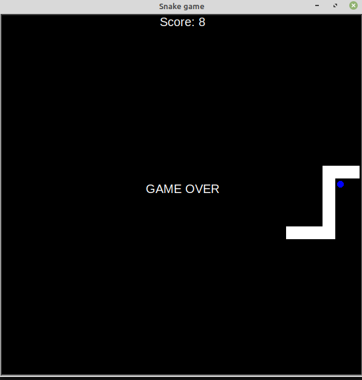

# Day20 -Day21

## Things learnt:
- Splice method

- Inheritance

## steps taken

- Create snake's body

- Move snake in any direction

- Add eventlistners to control the snake's movements

- Detect collision with food

- Detect collision with wall

- Detect collision with tail


## Project to solidify material learned 

### snake_game:
> This is a snake game like the one that was found on Nokia 6110,  made with Turtle graphics 

#### Preview:




## How to run this on your device

- Clone this repository
```
git clone https://github.com/kingdreamerr/Day20-Day21_snake_game.git
```
- cd into the repo
```
cd Day20-Day21_snake_game
```

- Paste the following in the terminal 
```
python3 main.py
```
